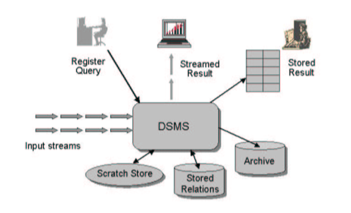
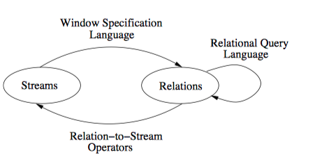

# 1、Stream: The Stanford Stream Data Manager
Stream 是斯坦福大学正在开发的一个通用系统，用来处理多个连续数据流和存储关系的系统。它可以解决高吞吐、大规模突发事件数据流问题。
如下图所示：

对于一个输入流，DSMS输入流产生源源不断的数据和查询处理，中间产生的状态我们保存在Scratch Store里面。在很多应用程序中需要把流式数据复制存档以便可以线下分析和查询处理。

stream 提供一个http的web接口，计划通过SOAP将公开系统的web服务，这样可以在任何平台上用任何语言来编写程序。

# 2、查询语言和处理
streamDB 设计了一种抽象语义和一个具体声明查询语言，用于连续数据流和关系进行连续查询。数据流建模成为一个无限的附加时间戳和元组的这样一对数据，以及是时变的元组对，它支持更新和删除、插入等操作。使用特殊的窗口运算符将数据流转换成关系，这种关系的转换是使用标准关系运算符进行的，然后转换好的关系数据可以转回流式数据。这部分主要依赖于一下几个抽象模块：
- 一种关系查询语言，可以抽象视其为一组关系到关系运算符
- 窗口规范语言，用来从流数据中提取元组，将其视其为一组流到关系的运算符。这些运算符合窗口没有任何关系。
如下图所示：

本文开发了一种具体的声明性的查询语言CQl,用于连续查询，CQL语言支持语法快捷方式和默认的设置。CQL由以下三个组件构成：
- 查询运算符对应于抽象语义三种预算，每个运算符从一组输入队列中读取元组，然后根据其语义处理单元，将其输出元组写入到输入队列。
- 运算符间队列用于缓冲作为输入，传递给一个或多个其他运算符。
# 3、算子调度
查询计划的执行由全局调度程序来控制，该调度程序在系统中与所有操作符相同的线程一同运行。每次调用调度程序时，它选择一个操作符来执行并调用其为该操作符定义的特定过程，作为参数传递操作符。

连续查询系统中调度程序的目标与传统DBMS中的目标略有不同。一些传统的调度目标，例如最小化运行时资源消耗和最大化吞吐量，适用于连续查询的上下文，在连续查询设置中不直接相关。处理数据流时一个重要目标是仔细管理运行资源（如内存）。在处理流时，因为许多实际数据流的到达速率是不规则的，表现出突发性和数据到达率随时间的变化，存储器管理面临着上述挑战。在处理高容量和突发数据流时，通常会缓冲临时的数据到达突发，并且在轻负载期间处理这些积压的元组。但是，流系统最大限度地减少积压缓冲所需的内存非常重要，否则，在重负载期间，总内存使用量可能超过可用物理内存，从而导致系统寻呼到磁盘并限制系统吞吐量。为了解决这个问题，本文开发了一种运营商调度策略，可以最大限度地减少积压缓冲的内存需求。这种称为链调度的策略在最小化单流查询的运行时内存使用方面几乎是最佳的，该单流的查询涉及选择、投影和存储关系的外键连接等。链调度对于具有多个流上的滑动窗口连接的查询以及上述类型的多个查询也表现良好。