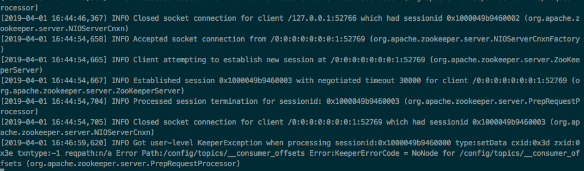
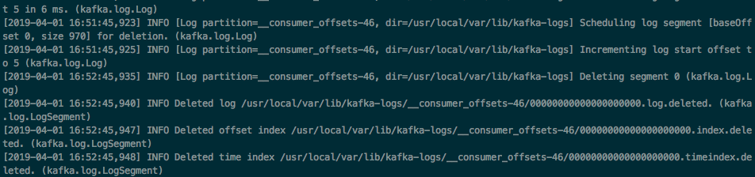
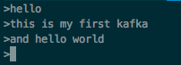
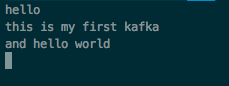

# 1、macOS 环境下kafka和zookeeper的安装
> kafka 是一个分布式流平台、发源于Linkedin，是一个快速、可扩展、高吞吐、可容错的分布式订阅消息系统。

> zookeeper是一个分布式的，开放源码的分布式应用程序协调服务，分布式应用程序可以基于它实现同步服务，配置维护和命名服务等。

## 1.1 使用 [brew](https://brew.sh/) 安装 zookeeper 

brew install zookeeper

安装之后 zookeeper 的配置文件在 /usr/local/etc/zookeeper

这里主要注意配置文件里面的clientPort：2181 即对外服务的端口，一般设置为2181(可修改)

启动服务是：zkServer start
查看状态是：zkServer status
停止服务：zkServer stop

## 1.2 安装kafka

brew install kafka

kafka的安装目录：/usr/local/Cellar/kafka/2.1.1/bin
kafka的配置目录：/usr/local/etc/kafka

# 2、启动kafka
*(先启动zookeeper，然后启动kafka，关闭服务的顺序正好相反，先关闭kafka，然后是关闭zookeeper)*
```
首先启动zookeeper
zookeeper-server-start /usr/local/etc/kafka/zookeeper.properties
```

```
然后启动kafka
kafka-server-start /usr/local/etc/kafka/server.properties
```


```
创建一个主题topic
kafka-topics --create --zookpeer localhost:2181 --replication-factor 1 --partitions 1 --topic new_build_1
// 创建一个名字为new_build_1的topic
```

```
查看已经创建的主题
kafka-topics --list --zookeeper localhost：2181
```

```
尝试自己产生一些数据
kafka-console-producer --broker-list localhost:9092 --topic new_build_1
然后输入一些字符：
> hello world 
> big data
```

```
使用如下命令：
kafka-console-consumer --bootstrap-server localhost:9092 --topic new_build_1 --from-beginning
```


# 3、关闭kafka和zookeeper
先关闭kafka，然后关闭zookeeper。

*虽然有 kafka-server-stop & zookeeper-server-stop*
但是并没有真正关闭，后台还在运行此端口的kafka，下次连接会导致port端口占用，一直无法成功启动kafka。

所以推荐使用如下命令关闭：
**brew services stop kafka** 、 **brew services stop zookeeper**

或者是到kafka/bin目录下：执行kafka-server-stop

然后执行：zookeeper-server-stop
