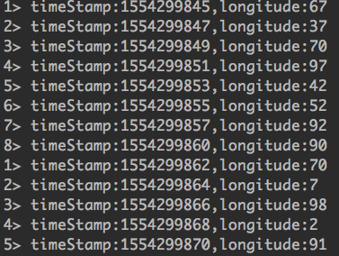
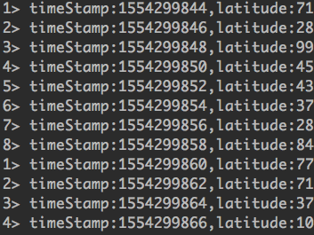
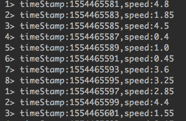

# 1、创建kafka 流数据
## 1.1 创建两个kafka流式数据，topic 分别是longitude 和 latitude
打开终端，启动zookeeper和kafka，然后创建两个topic，
- 创建topic 经度流数据
>kafka-topics --create --zookeeper localhost:2180 --replication-factor 1 --partitions 1 --topic longitude
- 创建topic 纬度流数据
>kafka-topics --create --zookeeper localhost:2180 --replication-factor 1 --partitions 1 --topic latitude

### 生成一个longitude 无限流数据
*格式为：timeStamp:时间戳，longitude:value*
```
public class longitudeWriterToKafka {
    public static void main(String[] args) throws Exception {
        // create execution environment
        StreamExecutionEnvironment env = StreamExecutionEnvironment.getExecutionEnvironment();
        Map properties = new HashMap();
        properties.put("bootstrap.servers", "localhost:9092");
        properties.put("group.id", "t12");
        properties.put("enable.auto.commit", "false");
        properties.put("auto.commit.interval.ms", "1000");
        properties.put("auto.offset.reset", "earliest");
        properties.put("session.timeout.ms", "30000");
        properties.put("key.deserializer", "org.apache.kafka.common.serialization.StringDeserializer");
        properties.put("value.deserializer", "org.apache.kafka.common.serialization.StringDeserializer");
        properties.put("topic", "longitude"); // 写入kafka的topic
    
        ParameterTool parameterTool = ParameterTool.fromMap(properties);

        // add a simple source which is writing some strings
        DataStream<String> messageStream = env.addSource(new SimpleStringGenerator());

        MapFunction<String, String> function = new MapFunction<String, String>() {
            private static final long serialVersionUID = 1L;

            @Override
            public String map(String value) throws Exception {
                return value;
            }
        };
        // write stream to Kafka
        messageStream.addSink(new FlinkKafkaProducer010<>(parameterTool.getRequired("bootstrap.servers"),
                parameterTool.getRequired("topic"),
                new SimpleStringSchema()));

        messageStream.rebalance().map(function);
        messageStream.print();
        env.execute();
    }

    public static class SimpleStringGenerator implements SourceFunction<String> {
        private static final long serialVersionUID = 2174904787118597072L;
        boolean running = true;

        @Override
        public void run(SourceContext<String> ctx) throws Exception {
            //int i=0;
            while (running) {
                //i++;
                ctx.collect(prouderJson());
                //System.out.println(prouderJson());
            }
        }

        @Override
        public void cancel() {
            running = false;
        }
    }

    public static String prouderJson() throws InterruptedException {
        //  long start = System.currentTimeMillis();
        long startTime = System.currentTimeMillis();
        Integer timestamp = getSecondTimestamp(startTime);
        String timeStamp = String.valueOf(timestamp);
        Integer value = randInt(1, 100);
        String valueString = String.valueOf(value);
        StringBuffer json = new StringBuffer();

        json.append("timeStamp" + ":" + timeStamp + "," + "longitude" + ":" + value);

        Thread.sleep(2000);
        return String.valueOf(json);
    }

    public static Float randmomUtils1(int i) throws Exception {
        Float value = RandomUtils.nextFloat(2950, 3080);
        switch (i) {
            case 1:
                value = RandomUtils.nextFloat(10, 90);
                break;
            case 2:
                value = RandomUtils.nextFloat(0, 80);
                break;
        }
        return value;
    }

    public static Float randmomUtils2(int i) throws Exception {
        Float value = RandomUtils.nextFloat(290, 300);
        switch (i) {
            case 1:
                value = RandomUtils.nextFloat(0, 200);
                break;
        }
        return value;
    }

    public static int getSecondTimestamp(long date) {
        String timestamp = String.valueOf(date);
        int length = timestamp.length();
        if (length > 3) {
            return Integer.valueOf(timestamp.substring(0, length - 3));
        } else {
            return 0;
        }
    }

    public static int randInt(int min, int max) {
        Random rand = new Random();
        int randomNum = rand.nextInt((max - min) + 1) + min;
        return randomNum;
    }
}

```
创建之后，每隔两秒生产一次0~100之间的随机数；

如下图1：<br>


### 生成一个latitude 无限流数据
*格式为：timeStamp:时间戳，latitude:value*

```
public class latitudeWriterToKafka {
    public static void main(String[] args) throws Exception {
        // create execution environment
        StreamExecutionEnvironment env = StreamExecutionEnvironment.getExecutionEnvironment();

        Map properties = new HashMap();
        properties.put("bootstrap.servers", "localhost:9092");
        properties.put("group.id", "t11");
        properties.put("enable.auto.commit", "false");
        properties.put("auto.commit.interval.ms", "1000");
        properties.put("auto.offset.reset", "earliest");
        properties.put("session.timeout.ms", "30000");
        properties.put("key.deserializer", "org.apache.kafka.common.serialization.StringDeserializer");
        properties.put("value.deserializer", "org.apache.kafka.common.serialization.StringDeserializer");
        properties.put("topic", "latitude"); // 写入kafka的topic
        ParameterTool parameterTool = ParameterTool.fromMap(properties);

        // add a simple source which is writing some strings
        DataStream<String> messageStream = env.addSource(new SimpleStringGenerator());

        MapFunction<String, String> function = new MapFunction<String, String>() {
            private static final long serialVersionUID = 1L;

            @Override
            public String map(String value) throws Exception {
                return value;
            }
        };
        // write stream to Kafka
        messageStream.addSink(new FlinkKafkaProducer010<>(parameterTool.getRequired("bootstrap.servers"),
                parameterTool.getRequired("topic"),
                new SimpleStringSchema()));

        messageStream.rebalance().map(function);
        messageStream.print();
        env.execute();
    }

    public static class SimpleStringGenerator implements SourceFunction<String> {
        private static final long serialVersionUID = 2174904787118597072L;
        boolean running = true;

        @Override
        public void run(SourceContext<String> ctx) throws Exception {
            while (running) {
                ctx.collect(prouderJson());
            }
        }
        @Override
        public void cancel() {
            running = false;
        }
    }
    public static String prouderJson() throws InterruptedException {
        //  long start = System.currentTimeMillis();
        long startTime = System.currentTimeMillis();
        Integer timestamp = getSecondTimestamp(startTime);
        String timeStamp = String.valueOf(timestamp);
        Integer value = randInt(1, 100);
        String valueString = String.valueOf(value);
        StringBuffer json = new StringBuffer();

        json.append("timeStamp" + ":" + timeStamp + "," + "latitude" + ":" + value);
        Thread.sleep(2000);
        return String.valueOf(json);
    }

    public static Float randmomUtils1(int i) throws Exception {
        Float value = RandomUtils.nextFloat(2950, 3080);
        switch (i) {
            case 1:
                value = RandomUtils.nextFloat(10, 90);
                break;
            case 2:
                value = RandomUtils.nextFloat(0, 80);
                break;
        }
        return value;
    }

    public static Float randmomUtils2(int i) throws Exception {
        Float value = RandomUtils.nextFloat(290, 300);
        switch (i) {
            case 1:
                value = RandomUtils.nextFloat(0, 200);
                break;
        }
        return value;
    }

    public static int getSecondTimestamp(long date) {
        String timestamp = String.valueOf(date);
        int length = timestamp.length();
        if (length > 3) {
            return Integer.valueOf(timestamp.substring(0, length - 3));
        } else {
            return 0;
        }
    }

    public static int randInt(int min, int max) {
        Random rand = new Random();
        int randomNum = rand.nextInt((max - min) + 1) + min;
        return randomNum;
    }
}
```
创建之后，每隔两秒生产一次0~100之间的随机数；

如下图2：<br>


### 生成一个unionStream 无限流数据
用来合并两个流式数据，进行计算之后的结果放到该topic中
- 创建topic 流数据
>kafka-topics --create --zookeeper localhost:2180 --replication-factor 1 --partitions 1 --topic unionStream

```
public class unionMultiStream {

    public static void main(String[] args) throws Exception {
        // create execution environment
        StreamExecutionEnvironment env = StreamExecutionEnvironment.getExecutionEnvironment();

        Map propertiesA= new HashMap();
        propertiesA.put("bootstrap.servers", "localhost:9092");
        propertiesA.put("group.id", "dec-esc-group-vib-calc");
        propertiesA.put("enable.auto.commit", "true");
        propertiesA.put("auto.commit.interval.ms", "1000");
        propertiesA.put("auto.offset.reset", "earliest");
        propertiesA.put("session.timeout.ms", "30000");
        propertiesA.put("key.deserializer", "org.apache.kafka.common.serialization.StringDeserializer");
        propertiesA.put("value.deserializer", "org.apache.kafka.common.serialization.StringDeserializer");
        propertiesA.put("topic", "longitude");

        Map propertiesB= new HashMap();
        propertiesB.put("bootstrap.servers", "localhost:9092");
        propertiesB.put("group.id", "dec-esc-group-vib-calc");
        propertiesB.put("enable.auto.commit", "true");
        propertiesB.put("auto.commit.interval.ms", "1000");
        propertiesB.put("auto.offset.reset", "earliest");
        propertiesB.put("session.timeout.ms", "30000");
        propertiesB.put("key.deserializer", "org.apache.kafka.common.serialization.StringDeserializer");
        propertiesB.put("value.deserializer", "org.apache.kafka.common.serialization.StringDeserializer");
        propertiesB.put("topic", "latitude");

        // output propertise
        Properties outputProperties = new Properties();
        outputProperties.setProperty("bootstrap.servers", "localhost:9092");
        outputProperties.setProperty("group.id", "t10");
        outputProperties.setProperty("enable.auto.commit", "false");
        outputProperties.setProperty("auto.commit.interval.ms", "1000");
        outputProperties.setProperty("auto.offset.reset", "earliest");
        outputProperties.setProperty("key.deserializer", "org.apache.kafka.common.serialization.StringDeserializer");
        outputProperties.setProperty("value.deserializer", "org.apache.kafka.common.serialization.StringDeserializer");
        outputProperties.setProperty("topic", "unionStream"); // 写入kafka的topic
        String outputTopic = "unionstream";


        //KafkaConsumer<String,String> kafkaConsumer = new KafkaConsumer<String, String>(properties);
        // parse user parameters
        //ParameterTool parameterTool = ParameterTool.fromArgs(args);
        ParameterTool parameterToolA = ParameterTool.fromMap(propertiesA);
        FlinkKafkaConsumer010 consumer010_A = new FlinkKafkaConsumer010(
                parameterToolA.getRequired("topic"), new SimpleStringSchema(), parameterToolA.getProperties());


        ParameterTool parameterToolB = ParameterTool.fromMap(propertiesB);
        FlinkKafkaConsumer010 consumer010_B = new FlinkKafkaConsumer010(
                parameterToolB.getRequired("topic"), new SimpleStringSchema(), parameterToolB.getProperties());

        //  consumer010.setStartFromEarliest();

        DataStream<String> messageStreamA = env.addSource(consumer010_A);
        DataStream<String> messageStreamB = env.addSource(consumer010_B);

        KeySelector<String, String> stream1 = new KeySelector<String, String>() {
            @Override
            public String getKey(String s1) throws Exception {
                String[] streamOne = s1.split(",");
                String value1 = streamOne[0].split(":")[0];
                return value1;
            }
        };

        KeySelector<String, String> stream2 = new KeySelector<String, String>() {
            @Override
            public String getKey(String s2) throws Exception {
                String[] streamOne = s2.split(",");
                String value2 = streamOne[0].split(":")[0];
                return value2;
            }
        };

        JoinFunction<String, String, String> function1 = new JoinFunction<String, String, String>() {
            @Override
            public String join(String s, String s2) throws Exception {
                Double valueX1 = Double.valueOf(s.split(":")[0]);
                Double valueX2 = Double.valueOf(s.split(":")[0]);
                Double valueY1 = Double.valueOf(s2.split(":")[0]);
                Double valueY2 = Double.valueOf(s2.split(":")[0]);

                Double d1 = Math.pow(valueX1-valueX2, 2);
                Double d2 = Math.pow(valueY1-valueY2, 2);
                Double distance = Math.sqrt(d1+d2);
                String speed = String.valueOf(distance/4.0);
                String timeStamp = s.split(":")[1];
                return "timeStamp:" + timeStamp +"," +"speed:" + speed;
            }
        };

        DataStream<String> sinkDownStream = messageStreamA.join(messageStreamB).where(stream1).equalTo(stream2).
                window(TumblingEventTimeWindows.of(Time.of(4, TimeUnit.SECONDS))).apply(function1);


        sinkDownStream.print();
        env.execute();
    }
}
```

通过计算经纬度，得到速度如下如所示:

